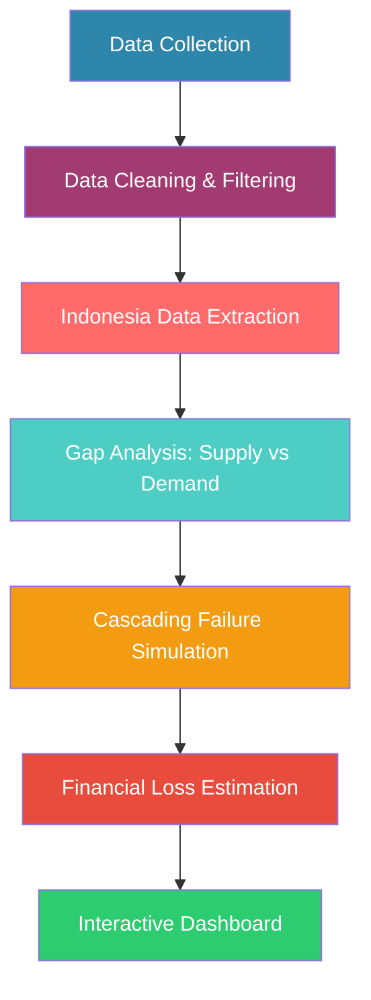

```
# ⚡ Indonesia Energy Grid Readiness Dashboard
### AI Data Center Impact Analysis | Cascading Failure Risk Assessment

[](https://www.python.org/)
[](https://streamlit.io/)
[](https://pandas.pydata.org/)
[](https://plotly.com/)
[](LICENSE)
[]()


---

## 📌 Table of Contents

- [Overview](#-overview)
- [Key Questions Answered](#-key-questions-answered)
- [Data Sources](#-data-sources)
- [Tech Stack](#-tech-stack)
- [Methodology](#-methodology)
- [Key Findings](#-key-findings)
- [Dashboard Features](#-dashboard-features)
- [Installation & Usage](#-installation--usage)
- [Project Structure](#-project-structure)
- [Recommendations](#-recommendations)
- [Author](#-author)

---

## 📌 Overview

This project analyzes the **readiness of Java's electrical grid** to handle the surge in electricity demand from a **500 MW AI data center** (Digital Edge CGK Campus in Bekasi) targeted to begin operations in **Q4 2026**.

**The analysis integrates:**

| Component | Description |
|:----------|:------------|
| ✅ Power Plant Data | 6,800+ plants globally (GPPD) |
| ✅ Transmission Network | GTD database for Indonesia |
| ✅ PLN Projection | RUPTL 2025-2034 |
| ✅ Actual Consumption | PLN West Java (2024-2025) |
| ✅ Risk Simulation | Cascading failure (Sumatra 2026 case study) |

---

## 🎯 Key Questions Answered

| # | Question | Answer |
|---|----------|--------|
| 1 | Is Java's power generation capacity sufficient for a 500 MW data center? | ✅ **YES** |
| 2 | Can the existing transmission network handle the additional load? | ⚠️ **LIMITED** (0 MW to Java) |
| 3 | What is the cascading failure risk if a disturbance occurs in Bekasi? | 🔴 **HIGH** |
| 4 | What is the estimated financial loss from an 18-hour blackout? | 💰 **US$ 45 Million** |

---

## 📊 Data Sources

| Source | Data | Year |
|:-------|:-----|:-----|
| **Global Power Plant Database** | 6,800+ power plants worldwide | 2024-2025 |
| **Global Transmission Database (GTD)** | Regional transmission capacity for Indonesia | 2025 |
| **RUPTL PLN** | Power plant capacity projection 2025-2034 | Official |
| **PLN West Java (UID Jabar)** | Actual data center electricity consumption | 2024-2025 |
| **Digital Edge / EDGNEX** | Data center projects in Bekasi & Jakarta | 2026 |

---

## 🛠️ Tech Stack

| Category | Technologies |
|:---------|:-------------|
| **Language** |  |
| **Data Processing** |   |
| **Visualization** |    |
| **Dashboard** |  |
| **Geospatial** |  |
| **Environment** |  |
| **Version Control** |   |

---

## 🔬 Methodology


### Analysis Steps:

1. **Data Filtering** - Extract Indonesia-specific data from global databases
2. **Validation** - Cross-reference with official PLN data (RUPTL)
3. **Gap Analysis** - Project supply vs demand (2025-2030)
4. **Cascading Simulation** - Model chain reaction failures (based on Sumatra 2026 event)
5. **Financial Impact** - Calculate losses per blackout scenario
6. **Dashboard** - Build interactive visualization with Streamlit

---

## 📈 Key Findings

| Finding | Detail |
|:--------|:-------|
| **Java's Generation Capacity** | ~45-68 GW (2025-2030) → **SAFE** |
| **Data Center Load 2030** | ~3,418 MW → only ~5% of capacity |
| **Transmission to Java** | **0 MW existing** → full reliance on local generators |
| **Cascading Failure Risk** | **HIGH** if disturbance at Bekasi substation |
| **18-Hour Blackout Loss** | **US$ 45 Million** (Rp 720 Billion) |

---

## 🗺️ Dashboard Features

| Page | Features |
|:-----|:----------|
| **🏠 Home** | Executive summary, key metrics, trend charts |
| **🗺️ Power Plant Map** | Interactive map of 5,000+ Indonesian power plants |
| **📈 Gap Analysis** | Demand vs capacity projection with project annotations |
| **🔌 Transmission & Recommendations** | Gantt chart, Sankey diagram, capacity comparison |
| **⚠️ Blackout Risk** | Vulnerability map, cascading simulation, mitigation plans |

---

### Sample Visualization: Vulnerability Map


The dashboard includes an **interactive vulnerability map** showing:
- 🔴 **Red markers**: Critical points (Bekasi Substation, SUTET)
- 🟠 **Orange markers**: Data center location (Digital Edge)
- 🟡 **Yellow markers**: Major power plants (Suralaya, Muara Tawar)

---

## 🖥️ Installation & Usage
### Prerequisites
- Python 3.11+
- Conda (recommended)

### Setup Environment
```bash
# Clone repository
git clone https://github.com/yourusername/energy-grid-readiness.git
cd energy-grid-readiness

# Create conda environment
conda create -n energi-2026 python=3.11 -y
conda activate energi-2026

# Install dependencies
pip install -r requirements.txt
```
### Run Analysis Scripts
```bash
# Run full analysis pipeline
python scripts/01_load_filter_plants.py
python scripts/02_load_transmission.py
python scripts/05_complete_analysis.py
python scripts/06_cascading_failure_analysis.py
```
### Run Dashboard
```bash
streamlit run dashboard/app.py
```
The dashboard will open at http://localhost:8501

---

## 📁 Project Structure
```
energy-grid-readiness/
│
├── dashboard/                 # Streamlit dashboard
│   ├── app.py                # Main page
│   ├── footer.py             # Copyright footer
│   └── pages/                # 4 interactive pages
│       ├── 1_Peta_Pembangkit.py
│       ├── 2_Analisis_Gap.py
│       ├── 3_Transmisi_Rekomendasi.py
│       └── 4_Risiko_Blackout.py
│
├── scripts/                  # Python analysis scripts
│   ├── 01_load_filter_plants.py
│   ├── 02_load_transmission.py
│   ├── 03_validate_ruptl.py
│   ├── 04_data_center_gap.py
│   ├── 05_complete_analysis.py
│   └── 06_cascading_failure_analysis.py
│
├── src/
│   └── config.py             # Path configuration
│
├── data/                     # Data (not uploaded to GitHub)
├── output/                   # Output (not uploaded)
├── requirements.txt          # Dependencies
├── .gitignore               # Git ignore rules
└── README.md                # Documentation
```

---

## 🎯 Recommendations
### For Digital Edge (Data Center Operator)
| Priority | Recommendation | Estimated Cost |
|:---------|:---------------|:---------------|
| 1 | **On-site BESS 2,000 MWh** (4-hour operation) | US$ 150-200M |
| 2 | **500 MW Diesel Genset** (N+1 redundancy) | US$ 50-100M |
| 3 | **Dual substation connection** (redundancy) | Negotiate with PLN |
| 4 | **15-30 min UPS** for bridging | US$ 10-20M |

### For PLN (Grid Operator)
| Priority | Recommendation |
|:---------|:---------------|
| 1 | **Accelerate Java-Sumatra transmission project** (target 2028) |
| 2 | **Double circuit SUTET Bekasi-Cawang** |
| 3 | **UFLS scheme** with data center as protected load |
| 4 | **Cascading failure audit** for Java-Bali system |

### Joint Collaboration

| Action | Frequency |
|:-------|:----------|
| Blackout simulation tabletop exercises | Every 6 months |
| Real-time SCADA communication link | 24/7 |
| SLA with compensation for >1 hour blackout | Annual review |

---

## 📊 Sample Outputs
| Analysis | Output File |
|:---------|:------------|
| Power plant data | `data/processed/indonesia_power_plants_clean.csv` |
| Transmission data | `data/processed/gtd_indonesia_existing.csv` |
| Gap analysis | `data/processed/final_gap_analysis.csv` |
| Cascading simulation | `data/processed/cascading_failure_analysis.json` |
| Vulnerability map | `output/figures/vulnerability_map.html` |

---
## 👨‍💻 Author
**Burhanudin Badiuzaman**  
*Data Analytics Portfolio Project*

[](https://github.com/burhanudinera2018/energy-grid-readiness)
[](https://www.linkedin.com/in/burhanudin-badiuzaman4a9204161/)
[](burhanudinera2018@gmail.com)

📜 License
This project is for **portfolio purposes only**.

**Data Sources:**

- Global Power Plant Database (CC BY 4.0)
- Global Transmission Database (Zenodo)
- RUPTL PLN (Official PLN document)
- PLN West Java (Public report)

---

## 🙏 Acknowledgments
- **Global Power Plant Database** - World Resources Institute
- **Global Transmission Database** - Dartmouth College Sustainable Transitions Lab
- **PLN (Persero)** - Indonesia's state electricity company
- **Digital Edge & EDGNEX** - Data center project announcements

---

<div align="center">
    <sub>© 2026 Burhanudin Badiuzaman - Portfolio Project Energy 2026</sub>
</div>
